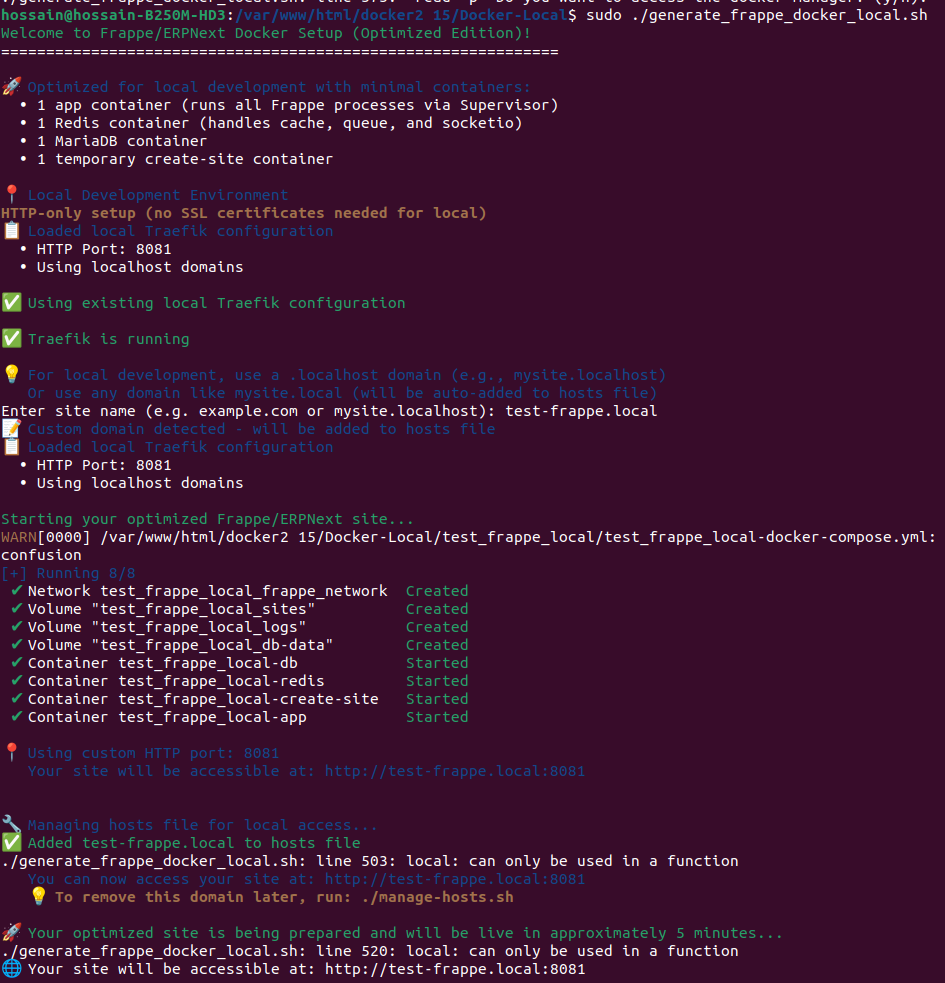
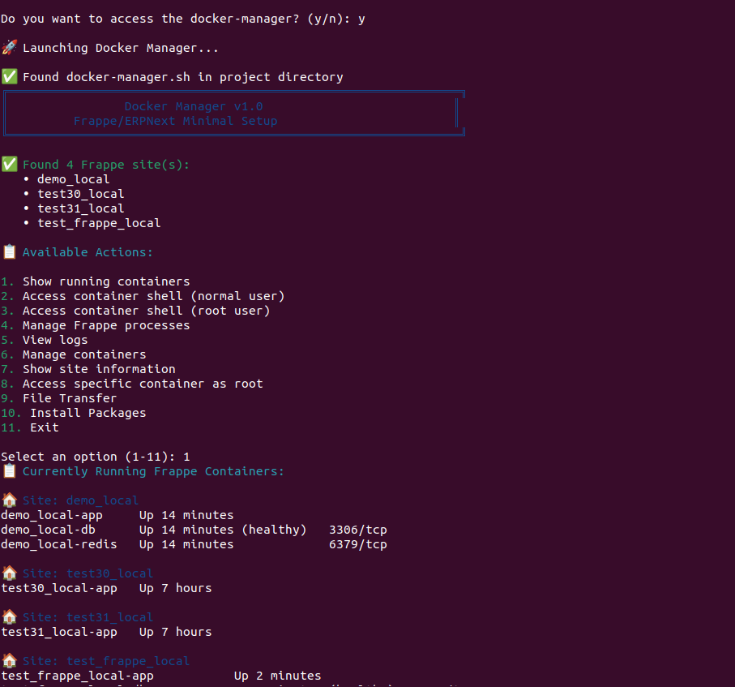
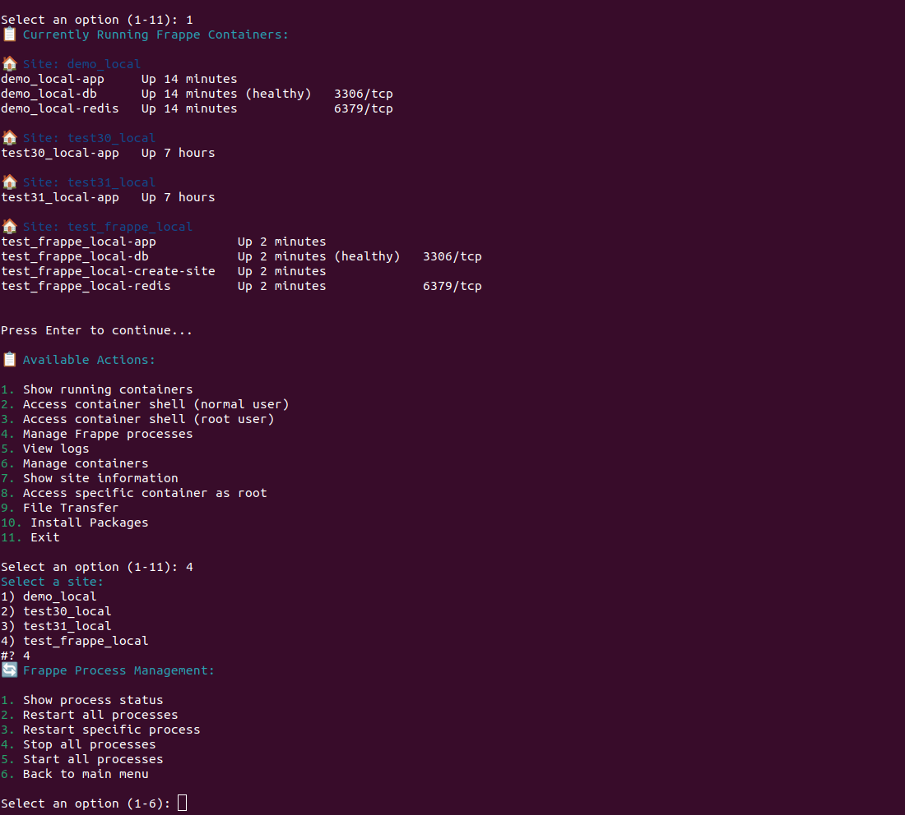
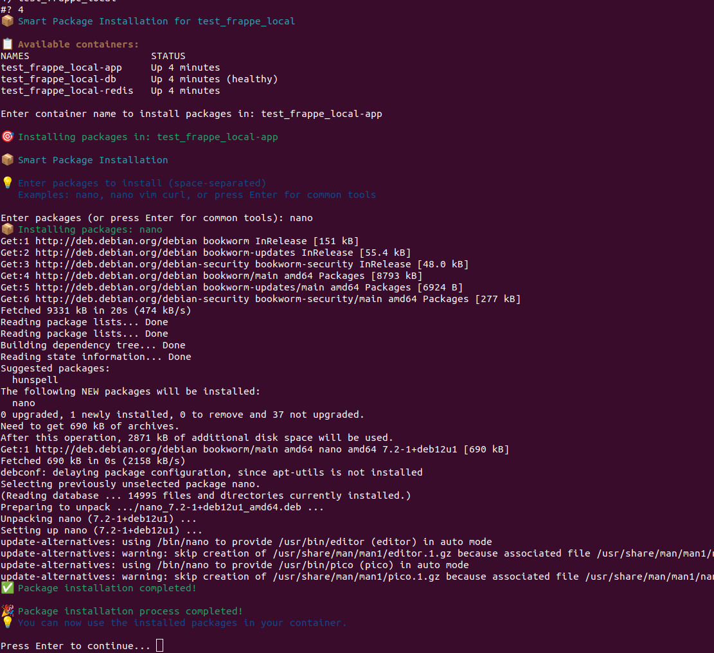

# Docker-Local: Frappe/ERPNext Local Development Setup

This folder contains optimized Docker tools for running Frappe/ERPNext locally with minimal resource usage and simplified management.

## 🚀 Quick Start

1. **Setup Traefik Local** (if not already done):
   ```bash
   cd ../
   sudo ./setup-traefik-local.sh
   ```

2. **Generate a new Frappe site**:
   ```bash
   sudo ./generate_frappe_docker_local.sh
   ```

3. **Manage your containers**:
   ```bash
   sudo ./docker-manager-local.sh
   ```

## 📁 Folder Structure

```
Docker-Local/
├── generate_frappe_docker_local.sh    # Main site generation script
├── docker-manager-local.sh            # Container management tool
├── traefik-docker-compose.yml        # Local Traefik configuration
├── .traefik-local-config             # Local port configuration
├── helper-screenshot/                 # Documentation screenshots
```

## 🛠️ Main Tools

### 1. generate_frappe_docker_local.sh

**Purpose**: Creates optimized Frappe/ERPNext Docker containers with minimal resource usage.

**Key Features**:
- **Optimized Architecture**: Only 4 containers instead of 9
- **Supervisor Integration**: All Frappe processes run in one container
- **Local Port Support**: Automatically detects custom Traefik ports
- **Hosts File Management**: Auto-adds domains to `/etc/hosts`
- **Smart Port Detection**: Shows correct URLs with custom ports

**Usage**:
```bash
sudo ./generate_frappe_docker_local.sh
```

**What it does**:
1. Checks Docker and Traefik status
2. Prompts for site name (e.g., `demo.local`, `mysite.localhost`)
3. Creates optimized `docker-compose.yml`
4. Starts containers with Supervisor-managed processes
5. Manages hosts file entries
6. Shows access information with correct ports

**Screenshot**: 

### 2. docker-manager-local.sh

**Purpose**: Comprehensive container management tool for local Frappe/ERPNext sites.

**Key Features**:
- **Container Status**: View all running containers
- **Process Management**: Manage Frappe processes via Supervisor
- **Container Access**: Access containers as frappe user or root
- **Log Management**: View and manage container logs
- **Site Operations**: Start, stop, restart, and remove sites
- **Package Installation**: Install packages in containers
- **Network Management**: Manage Docker networks

**Usage**:
```bash
sudo ./docker-manager-local.sh
```

**Main Menu Options**:
1. **Show running containers** - Display all active Frappe containers
2. **Access container shell (normal user)** - Interactive shell as frappe user
3. **Access container shell (root user)** - Interactive shell as root user
4. **Manage Frappe processes** - Start/stop/restart Supervisor processes
5. **View logs** - Monitor container and application logs
6. **Manage containers** - Start, stop, restart, and remove containers
7. **Show site information** - Display detailed site configuration
8. **Access specific container as root** - Root access to any container
9. **File Transfer** - Transfer files between host and containers
10. **Install Packages** - Add software packages to containers
11. **Exit** - Close the docker manager

**Detailed Menu Functions**:

- **Option 1**: Lists all running Frappe containers with status and port information
- **Option 2**: Opens bash shell as frappe user (recommended for most operations)
- **Option 3**: Opens bash shell as root user (for system-level changes)
- **Option 4**: Manages Frappe processes via Supervisor (start/stop/restart)
- **Option 5**: Displays real-time logs from containers and applications
- **Option 6**: Container lifecycle management (start, stop, restart, remove)
- **Option 7**: Shows detailed configuration and status of Frappe sites
- **Option 8**: Provides root access to any specific container by name
- **Option 9**: Enables file transfer between host system and containers
- **Option 10**: Installs software packages inside containers
- **Option 11**: Safely exits the docker manager

**Screenshots**:
- 
- 
- 

## 🔧 Configuration

### Local Traefik Configuration

The `.traefik-local-config` file contains:
```bash
TRAEFIK_HTTP_PORT=8081      # Custom HTTP port
USE_LOCALHOST=true          # Use localhost domains
```

**Port Detection**: The scripts automatically detect and use custom ports from this configuration.

### Site Configuration

Each generated site includes:
- **App Container**: Runs all Frappe processes via Supervisor
- **Database**: MariaDB 10.6
- **Redis**: Handles cache, queue, and socketio
- **Create-site**: Temporary container for initial setup

## 📊 Optimized Architecture

**Traditional Setup**: 9 containers
**Local Optimized**: 4 containers

**Benefits**:
- ⚡ **Faster startup** times
- 💾 **Lower memory** usage
- 🔧 **Easier management** with Supervisor
- 🌐 **Simplified networking**
- 📝 **Better logging** and process control

## 🚦 Process Management

### Supervisor Commands

Access container and manage processes:
```bash
# Check status
sudo docker exec SITE_NAME-app /home/frappe/.local/bin/supervisorctl -c /home/frappe/supervisor/supervisord.conf status

# Restart web process
sudo docker exec SITE_NAME-app /home/frappe/.local/bin/supervisorctl -c /home/frappe/supervisor/supervisord.conf restart frappe-web

# Restart all processes
sudo docker exec SITE_NAME-app /home/frappe/.local/bin/supervisorctl -c /home/frappe/supervisor/supervisord.conf restart all
```

### Available Processes
- `frappe-web` - Web server (port 8000)
- `frappe-schedule` - Background scheduler
- `frappe-worker-short` - Short queue worker
- `frappe-worker-long` - Long queue worker
- `frappe-worker-default` - Default queue worker
- `frappe-websocket` - WebSocket server (port 9000)

## 🌐 Access Information

### Default Credentials
- **Username**: `Administrator`
- **Password**: `admin`

### Access URLs
- **Custom Port**: `http://yourdomain.local:8081`
- **Default Port**: `http://yourdomain.local`

### Port Detection
The scripts automatically detect your local Traefik configuration and show the correct access URLs with custom ports.

## 📋 Common Operations

### Create a New Site
```bash
sudo ./generate_frappe_docker_local.sh
# Follow prompts for site name
```

### Manage Existing Sites
```bash
sudo ./docker-manager-local.sh
# Use menu options to manage containers
```

### Access Container
```bash
# Via docker-manager-local.sh (recommended)
sudo ./docker-manager-local.sh

# Direct access
sudo docker exec -it SITE_NAME-app bash
```

### View Logs
```bash
# Via docker-manager-local.sh
sudo ./docker-manager-local.sh

# Direct access
sudo docker exec SITE_NAME-app tail -f /home/frappe/supervisor/logs/frappe-web.log
```

## 🚨 Troubleshooting

### Port Conflicts
If ports 80/443 are in use:
```bash
cd ../
sudo ./setup-traefik-local.sh
```

### Container Issues
1. Check container status: `sudo docker ps -a`
2. View logs: `sudo docker logs SITE_NAME-app`
3. Restart processes via Supervisor
4. Use docker-manager-local.sh for comprehensive management

### Hosts File Issues
```bash
# Check hosts file
cat /etc/hosts

# Remove domain manually
sudo sed -i '/yourdomain.local/d' /etc/hosts
```

## 🔒 Security Notes

- **Local Development Only**: These tools are designed for local development
- **No SSL**: HTTP-only setup for simplicity
- **Default Passwords**: Change default passwords in production
- **Network Isolation**: Uses bridge networks for container isolation

## 📚 Additional Resources

- **Main Documentation**: `../README.md`
- **Traefik Setup**: `../setup-traefik-local.sh`
- **Docker Manager**: `../docker-manager.sh`
- **Security Tools**: `../docker-security-tools.sh`

## 🤝 Contributing

1. Test changes in local environment
2. Update screenshots if UI changes
3. Maintain backward compatibility
4. Document new features

## 📄 License

This project follows the same license as the main repository.

---

**💡 Pro Tip**: Use `docker-manager-local.sh` for most container operations - it provides a user-friendly interface and handles complex operations automatically.
