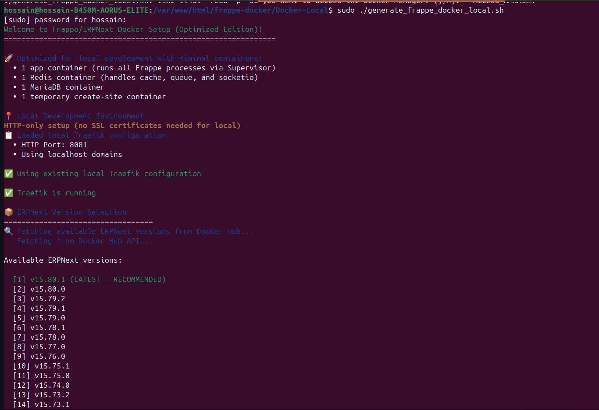
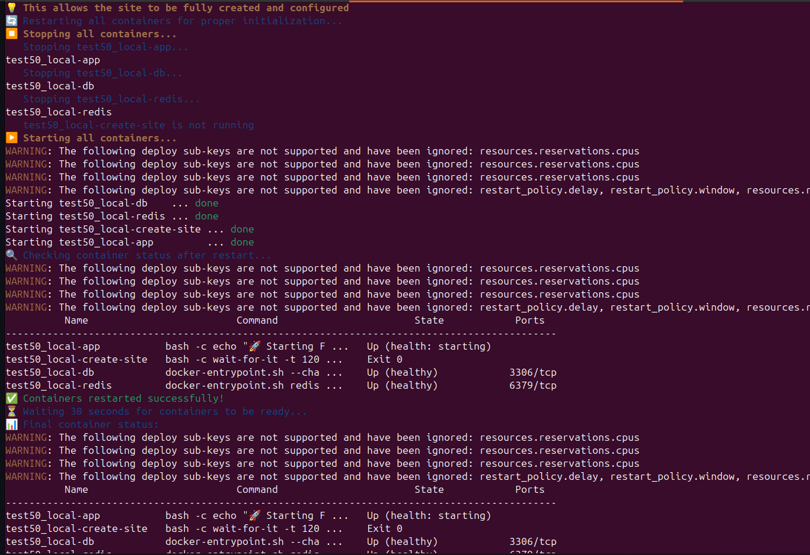
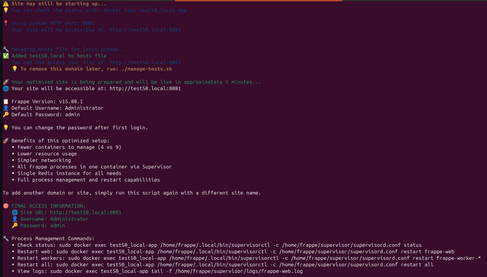
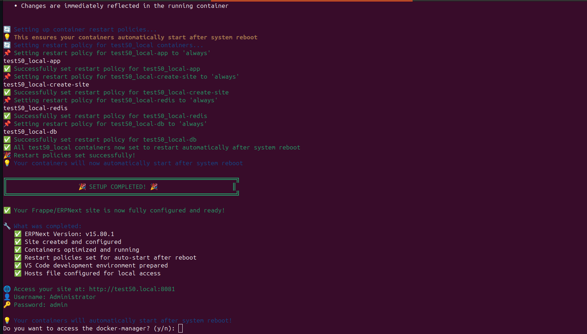
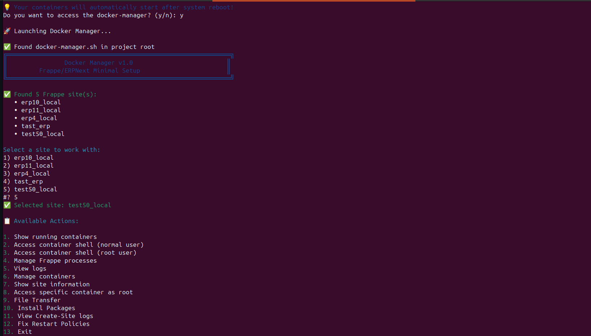

# 🚀 Frappe/ERPNext Docker Manager

A powerful web-based Docker management tool for deploying and managing Frappe/ERPNext applications with both **local development** and **production** environments.

## 🎯 Quick Start

### 🌐 **Production Setup** (VPS/Cloud)
```bash
# 1. Generate production site
chmod +x generate_frappe_docker.sh
./generate_frappe_docker.sh

# 2. Manage containers
./docker-manager.sh
```

### 🏠 **Local Development**
```bash
# Mac (Recommended - No sudo)
./Docker-Local/setup-traefik-local-mac-no-sudo.sh
./Docker-Local/generate_frappe_docker_local.sh

# Linux
sudo ./Docker-Local/setup-traefik-local.sh
sudo ./Docker-Local/generate_frappe_docker_local.sh
```

## 🖥️ Web Docker Manager

The **Web Docker Manager** is a powerful web interface for managing Frappe/ERPNext Docker containers.

### Features
- **App Management**: Install, uninstall, and update Frappe apps
- **Site Management**: Create and manage multiple sites
- **Terminal Access**: Integrated SSH terminal
- **Real-time Logs**: Operation logs with auto-scroll
- **Container Management**: Start, stop, restart containers
- **Process Control**: Manage Frappe processes (web, workers, scheduler)

### Access
- **Web Interface**: `http://your-server:5000`
- **Login**: Use your system credentials

## 📸 Screenshots

### 1. Docker Manager Dashboard

Main dashboard showing all containers and their status.

### 2. Container Selection

Interface for selecting and managing specific containers.

### 3. App Installation Interface

Complete Frappe/ERPNext app installation and management interface.

### 4. Terminal Access Tab

Integrated terminal for direct container access.

### 5. SSH Access Tab

Secure SSH connection management.

### 6. Powerful Docker Manager

Comprehensive Docker management interface - **Super powerful tool for end-to-end Docker management**.

## 🏗️ Architecture

### Production (VPS/Cloud)
```
├── site-app/          # Main application (Supervisor + all Frappe processes)
├── site-db/           # MariaDB 10.6 database
├── site-redis/        # Redis 6.2 (cache, queue, socketio)
└── site-create-site/  # Temporary setup container
```

### Local Development
```
├── site-app/          # Main application (optimized for development)
├── site-db/           # MariaDB 10.6 database
├── site-redis/        # Redis 6.2 (cache, queue, socketio)
└── site-create-site/  # Temporary setup container
```

## 🛠️ Container Management

### Command Line Tools
```bash
# VPS/Production
./docker-manager.sh

# Local Development
sudo ./web-manager/docker-manager.sh
```

### Web Interface
Access the Web Docker Manager at `http://your-server:5000` for:
- Visual container management
- App installation interface
- Terminal access
- Real-time monitoring

## 🔧 Process Management

```bash
# Check process status
docker exec SITE_NAME-app /home/frappe/.local/bin/supervisorctl -c /home/frappe/supervisor/supervisord.conf status

# Restart all processes
docker exec SITE_NAME-app /home/frappe/.local/bin/supervisorctl -c /home/frappe/supervisor/supervisord.conf restart all
```

**Available Processes**:
- `frappe-web` - Web server
- `frappe-schedule` - Background scheduler
- `frappe-worker-short` - Short queue worker
- `frappe-worker-long` - Long queue worker
- `frappe-worker-default` - Default queue worker
- `frappe-websocket` - WebSocket server

## 🚨 Troubleshooting

### Container Issues
```bash
# Check container logs
docker logs SITE_NAME-app

# Restart container
docker restart SITE_NAME-app
```

### Process Issues
```bash
# Access container
docker exec -it SITE_NAME-app bash

# Check Supervisor status
/home/frappe/.local/bin/supervisorctl -c /home/frappe/supervisor/supervisord.conf status
```

## 📚 Documentation

- **Local Development**: [Docker-Local/README.md](Docker-Local/README.md)
- **VPS/Production**: [Docker-on-VPS/README.md](Docker-on-VPS/README.md)
- **VPS Manager**: [Docker-on-VPS/DOCKER_MANAGER.md](Docker-on-VPS/DOCKER_MANAGER.md)

## 🍎 Mac Users

**Recommended Setup** (No sudo required):
```bash
./Docker-Local/setup-traefik-local-mac-no-sudo.sh
./Docker-Local/generate_frappe_docker_local.sh
```

**Benefits**:
- Native .localhost support
- Port 8081 default (avoids system conflicts)
- Docker Desktop optimized
- No hosts file editing required

## 💾 Backup & Recovery

```bash
# Backup database
docker exec SITE_NAME-db mysqldump -u root -padmin --all-databases > backup.sql

# Backup volumes
docker run --rm -v SITE_NAME_sites:/data -v $(pwd):/backup alpine tar czf /backup/sites-backup.tar.gz /data
```

## 🌐 Multiple Sites

```bash
# Production
./generate_frappe_docker.sh  # site1.com
./generate_frappe_docker.sh  # site2.com

# Local
sudo ./Docker-Local/generate_frappe_docker_local.sh  # demo.localhost
sudo ./Docker-Local/generate_frappe_docker_local.sh  # test.localhost
```

## 🔐 Security

### Production
- ✅ SSL/HTTPS with Let's Encrypt
- ✅ Cloudflare integration
- ✅ Firewall configuration
- ✅ Regular updates

### Local Development
- ✅ Local network only
- ✅ Custom ports
- ✅ Isolated environment

---

## 🚀 Quick Reference

### Production Setup
```bash
chmod +x generate_frappe_docker.sh
./generate_frappe_docker.sh
./docker-manager.sh
```

### Local Development
```bash
# Mac (recommended)
./Docker-Local/setup-traefik-local-mac-no-sudo.sh
./Docker-Local/generate_frappe_docker_local.sh

# Linux
sudo ./Docker-Local/setup-traefik-local.sh
sudo ./Docker-Local/generate_frappe_docker_local.sh
```

### Web Interface
- **URL**: `http://your-server:5000`
- **Features**: App management, terminal access, real-time logs

---

**💡 Pro Tip**: Use the **Web Docker Manager** for the best experience - it's a super powerful tool for managing your Frappe/ERPNext Docker containers!

**🎯 Ready to Deploy?** Choose your environment and get started! 🚀