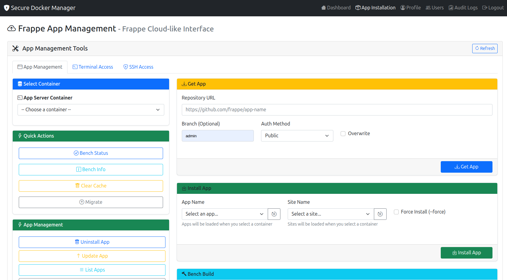
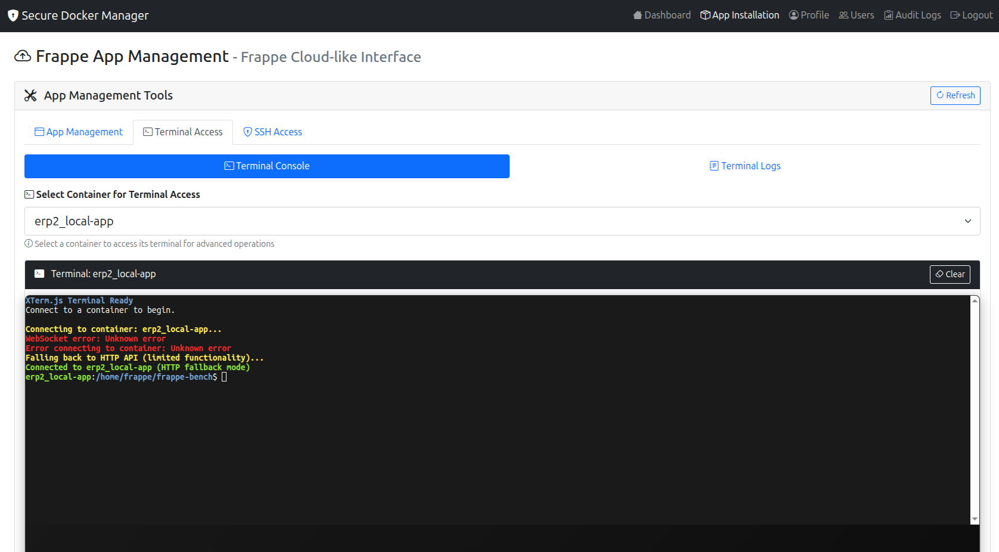
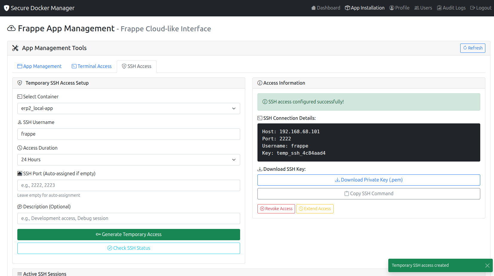

# Secure Docker Manager

A professional web-based Docker container management system with advanced security features.

## 🚀 Quick Start

### Single Command Setup
```bash
./docker-manager.sh install
```

### Start the Application
```bash
./docker-manager.sh start
```

## 📋 Available Commands

| Command | Description |
|---------|-------------|
| `./docker-manager.sh` | Start the application (default) |
| `./docker-manager.sh install` | Install dependencies and setup environment |
| `./docker-manager.sh start` | Start the application |
| `./docker-manager.sh setup` | Setup database only |
| `./docker-manager.sh status` | Show application status |
| `./docker-manager.sh help` | Show help message |

## 🌐 Access the Application

- **URL**: http://localhost:5000
- **Default Login**: `admin` / `admin123`

## ✨ Features

- **Professional UI** with modern design
- **User Management** with CRUD operations
- **Two-Factor Authentication** (optional)
- **Account Lockout** protection
- **Audit Logging** for security
- **CSRF Protection**
- **IP Whitelisting**
- **HTTPS Support**
- **SSH Terminal Access** with web-based interface
- **Container Management** with real-time monitoring

## 📸 Screenshots

### Dashboard Overview


### Container Management


### User Management


### SSH Terminal


## 📚 Documentation

- [Database Setup Guide](DATABASE_SETUP.md) - Complete database setup and migration guide

## 🔧 Requirements

- Python 3.8+
- MySQL/MariaDB
- Linux/Unix environment

## 🆘 Troubleshooting

Run `./docker-manager.sh status` to check the application status and identify any issues.

---

**Version**: 2.0  
**Last Updated**: January 2025
